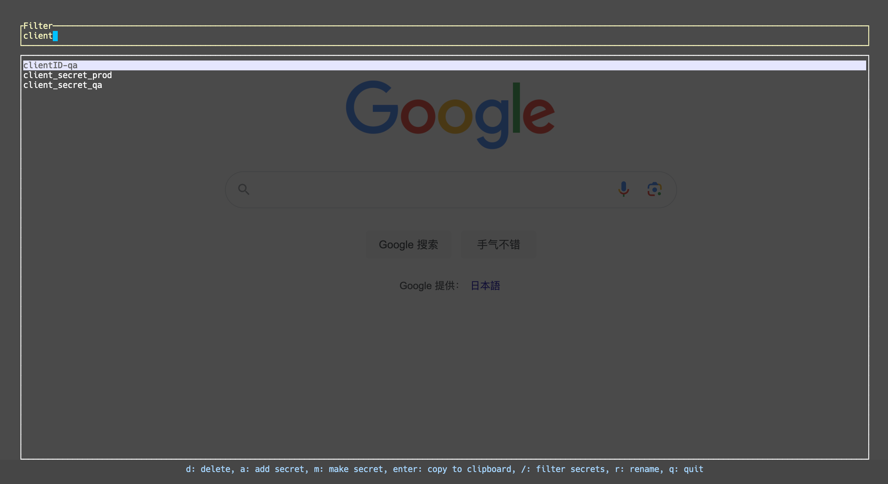

My secret management tool through command interface

## Usage
```sh
# enter tui
secm
```

## Install
**Through git repo**
```shell
git clone https://github.com/f91og/secm.git && cd secm && cargo install --path .
```

**Through brew [TBD]**


## Features
- Add, Retrieve, Rename, Delete Secrets
- Encryption
- Secret string generation
- Secret search

⚠️ currently only support mac

## TBD
- install through homebrew
- desktop&mobile GUI
- secret sync among different devices
